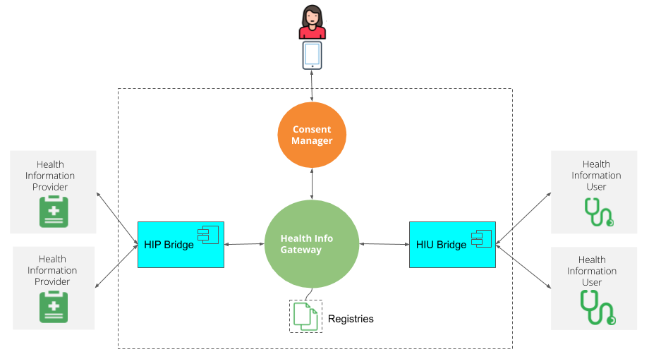

### Components
There are 4 essential components of Federated Health Records as par NHS Architecture. Three are representative of entities that are involved i) Patient herself ii) Healthcare Services who act as Information Providers iii) Users of the health information (practitioners, payers etc) and iv) a fiduciary/trustee that facilitates the discovery, linking of patient  within the network and consented means of exchange of patient's health information.  

Note, the above diagram represents HIU and HIPs as HIU-Bridge and HIP-Bridge respectively, but the official terminology is Health Repository or Health Data Repository. For technical distinction we may refer to them as Bridges, which may serve one HIU/HIP or many.  

1. Health Data Consent Manager (HDCM): A fiduciary/trustee that manages patient consents, and facilitates discovery, exchange of health information exchange between HIP and HIU as consented by the Patient. 
- HDCM provides a reference Patient App - with which a patient can signup with HDCM, linkup with providers, grant consents for health information acccess, and view patient Health records. In future, more access channels (e.g a Web Portal) may be introduced. 
2. Health Information Gateway (Gateway): A hub that mediates and connects HDCMs and Bridges (HIU and HIP) in this network. Its primary job is to allow for discovery, routing in the network. Bridges and HDCMs register themselves with the Gateway, and gateway includes them ontto the networks post validdation. 
3. Health Information User (HIU) Bridge: A system that acts as bridge/connector as a bridge/connector of the HIUs to the network. A HIU system is also a Health Repository. 
- Reference implementation has a HIU server backend system, that does the interfacing with the Gateway, thereby providing a starter point of HIU Bridge, and a simple Doctor's interface.  
4. Health Information Provider (HIP) Bridge: A system that acts as bridge/connector  as a bridge/connector of the Health Information Providers to the network.   A HIP system is also a Health Repository. 
- Reference implementation is a headless service, handling the common workflow/interactions, while providing extension means for plugging HIP specific Health Information System, and has sets of useful toolings, shared Libraries etc. Its purpose is to act as starter material for HIP Bridges and act as example/references of HIP integration. 

In most cases, the HIU and the HIP may be the same, connected to the same Bridge/Repository. The distinction of the bridges above is made so as to maintain the representations of the involved entities. Bridges represent one or more HIU/HIPs in the ecosystem, and registers so with the Gateway.  

The reference implementation stack has 5 distinct solutions/applications, reflecting each primary purpose. 
